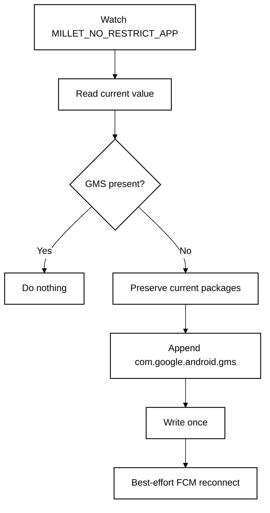

<p align="center">
  <a href="README.md"><strong>English</strong></a> · <a href="README.zh-CN.md">简体中文</a>
</p>

<p align="center">
  
</p>

# FCM Guard for OriginOS &amp; HyperOS

**A lightweight, no-root watchdog for Vivo OriginOS and Xiaomi HyperOS China ROMs that keeps Google Play services active and protected so FCM push stays reliable.**

**Designed for:** China-market Vivo / iQOO and Xiaomi / Redmi / POCO phones with Google Play services installed and working.

<p align="center">
  <a href="https://github.com/ReedGAOOO/FCMGuard-HyperOS/releases/latest/download/FCMGuard-HyperOS.apk"><strong>Download latest APK</strong></a>
  ·
  <a href="https://github.com/ReedGAOOO/FCMGuard-HyperOS/releases/latest">Latest release</a>
</p>

## Highlights

- **Native OriginOS &amp; HyperOS support** — automatic ROM detection dynamically provides the right deep links, AppOps probes, and optimization instructions.
- **No root or Shizuku** — uses the user-grantable **Modify system settings** permission instead of root, persistent ADB, Accessibility, VPN, overlay, or device-admin privileges.
- **Finance-app friendly** — keeps the implementation deliberately low-privilege for better compatibility with security-sensitive apps.
- **Low background power** — exact event-driven monitoring is the main path; the 30-minute fallback is in-process, non-waking, and refreshes the FCM connection socket.
- **Background power management** — direct one-tap shortcuts to Vivo OriginOS "High background power consumption" / iManager and Xiaomi autostart.
- **Reconnects only when needed** — FCM/MCS reconnect broadcasts are sent after whitelist repairs, periodic keep-alive checks, or a manual request.
- **Optional persistent notification** — foreground mode uses a visible-but-silent notification channel for stronger process survival against OriginOS / HyperOS aggressive killers.
- **FCM app assistant** — scans likely Firebase/GCM clients and inspects Autostart / background run state with per-app shortcut to vendor power and permission settings.
- **Native dark mode** — System / Light / Dark, with **System** as the default.
- **10-language UI** — English, Simplified Chinese, Traditional Chinese, French, Japanese, Korean, Spanish, Portuguese, German, and Russian through Android's native per-app language mechanism.
- **Compact-phone ready** — responsive layout checks cover 320–480dp widths.

## Quick setup

### For Vivo OriginOS:
1. Install the APK and open FCM Guard.
2. Grant **Modify system settings**.
3. Tap **Configure Autostart** → Enable Autostart for FCM Guard and Google Play services.
4. Tap **Background power** → In OriginOS battery management, set FCM Guard and GMS to **Allow high background power consumption** (or Unrestricted).
5. Tap **Unrestrict battery** to grant battery optimization bypass.
6. Enable **Automatic protection** and keep **Persistent notification** ON.
7. Lock FCM Guard in the **Recent Apps** screen (taskbar) so OriginOS doesn't swipe-clear it.
8. Optional: Scan **FCM apps** and tap any app to jump directly to its background power or permission settings.

### For Xiaomi HyperOS:
1. Install the APK, open FCM Guard, and grant **Modify system settings**.
2. Tap **Repair now** once.
3. Enable **Automatic protection**.
4. In HyperOS, enable **Autostart** for FCM Guard and set battery policy to **No restrictions**.
5. Keep **Persistent notification** enabled for maximum survival reliability.
6. Optional: scan **FCM apps** to verify autostart state. Tap **Open FCM diagnostics** to inspect the `mtalk.google.com:5228` connection.

> FCM Guard is mainly for China-ROM HyperOS 3 devices where Google services work normally but PowerKeeper / Greezer can still interrupt the background FCM connection.

---

# Technical overview

## Core mechanism

Affected HyperOS builds can rebuild the private setting:

```text
Settings.System.MILLET_NO_RESTRICT_APP
```

If `com.google.android.gms` is removed, Google Play services can be treated like a normal background process and its long-lived FCM/MCS connection may be interrupted.

FCM Guard reads the current comma-separated value, preserves all existing packages, and appends `com.google.android.gms` only when it is missing.



## Why `targetSdk 22`?

FCM Guard intentionally uses `compileSdk 35` with `targetSdk 22`. The modern compile SDK keeps current tooling, while the legacy target preserves the compatibility path needed to write Xiaomi's vendor-private `Settings.System` key with the user-grantable **Modify system settings** permission and without root/Shizuku.

## Low-power design

- Exact `ContentObserver` only for `MILLET_NO_RESTRICT_APP`.
- ~400 ms debounce after an observed change.
- 30-minute in-process fallback instead of rapid polling.
- No `AlarmManager`, repeating exact alarm, or WakeLock for the fallback.
- No write when GMS is already present.
- No reconnect broadcast unless a repair actually happened or the user requests one.

## Persistent notification

Persistent mode runs `GuardService` as a foreground service. The current implementation uses a dedicated `IMPORTANCE_LOW`, silent notification channel so the notification remains visible without sound or vibration. Because FCM Guard deliberately targets SDK 22, Android 13+ controls the notification-permission prompt timing; if notifications are already blocked, FCM Guard links directly to the app's system notification settings.

## FCM diagnostics

**Open FCM diagnostics** now launches the current Google Play services activity first:

```text
com.google.android.gms/com.google.android.gms.gcm.GcmDiagnostics
```

Older `GTalkServiceDiagnostics` is retained as a compatibility fallback, with a final best-effort lookup for a diagnostics activity inside Google Play services.

## FCM app assistant

The scanner looks for standard manifest signals such as:

```text
com.google.firebase.MESSAGING_EVENT
com.google.android.c2dm.intent.RECEIVE
```

A match means the app is a likely FCM/GCM client, not proof that every notification from that app uses FCM.

For detected apps, FCM Guard performs a **read-only, best-effort** check of Xiaomi's vendor Autostart AppOps (`10008` and `10053`). When both are readable, the UI reports:

- **Enabled** — both Autostart AppOps are allowed.
- **Partial** — one is allowed and the other is explicitly ignored.
- **Disabled** — both are explicitly ignored.
- **Unknown** — HyperOS blocked the query, returned a vendor/default state that cannot be interpreted safely, or otherwise did not expose a reliable result.

FCM Guard never treats **Unknown** as **Disabled**. If every detected app is Unknown, the per-app list is hidden and the assistant falls back to the detected count plus the single **Configure all in HyperOS** action. After returning from HyperOS settings, an expanded result is checked again automatically.

No Autostart state is modified programmatically, and no Shizuku/root/ADB privilege is introduced.

## Per-app delivery caveat

FCM Guard protects the Google Play services / FCM transport layer, but it does **not** override HyperOS battery rules for every receiving app. Some apps — including messaging apps such as **WhatsApp** — may use FCM as a wake-up/tickle path and still need their own process to run, open a background network connection, synchronize data, and generate the local notification.

Therefore, if FCM diagnostics are healthy and other apps receive pushes normally but one app is still delayed, configure that app separately. For WhatsApp, the recommended HyperOS setting is:

**WhatsApp → Battery saver / Battery optimization → No restrictions**

Also enable **Autostart** for the affected app when the ROM exposes that option. This should be applied only to apps that actually show delayed delivery rather than globally disabling battery optimization for every app.

## Appearance, languages, and responsive layout

- System / Light / Dark appearance modes.
- 10 native app languages: English, Simplified Chinese, Traditional Chinese, French, Japanese, Korean, Spanish, Portuguese, German, and Russian.
- Compact and large-width resource profiles.
- CI geometry checks for 320, 360, 393, 411, 430, and 480dp widths.

## Permissions and privacy

FCM Guard uses `WRITE_SETTINGS`, `RECEIVE_BOOT_COMPLETED`, foreground-service/notification support, and narrow package visibility for FCM/GCM handlers, Google Play services, and Xiaomi Security Center.

It does **not** require root, Shizuku, persistent ADB, Accessibility, VPN, overlay, device-admin, account access, or traffic inspection.

## Limitations

This project depends on Xiaomi's current HyperOS implementation. Xiaomi can change PowerKeeper / Greezer behavior, the private setting, app-management pages, or vendor AppOps behavior in future releases. FCM reconnect, FCM-client detection, and Autostart-status reading are all best-effort because Android does not expose public APIs that guarantee these vendor-specific operations.

FCM Guard protects the shared GMS/FCM connection; it cannot guarantee that HyperOS will allow every individual app enough background execution or network time to process a delivered FCM wake-up. Per-app battery settings may still be required for apps such as WhatsApp.

## References & Acknowledgements

The PowerKeeper / Greezer investigation and the `MILLET_NO_RESTRICT_APP` repair strategy were originally documented by **HyperOS FCM Fix**:

- HyperOS FCM Fix by `dingwen07`: https://github.com/dingwen07/hyperos-fcm-fix
- Technical investigation: https://github.com/dingwen07/hyperos-fcm-fix/blob/main/docs/xiaomi-hyperos-gms-fcm-greezer-investigation.md

FCM Guard is an independent implementation focused on no Shizuku/root dependency, minimal privileges, event-driven monitoring, and low idle background activity. No source code from HyperOS FCM Fix is copied into this repository.

## Build

GitHub Actions checks responsive layout profiles and builds a signed debug APK. Pushes to `main` publish/update the versioned GitHub Release; feature branches can be validated before release.

For normal phone installation, use:

**https://github.com/ReedGAOOO/FCMGuard-HyperOS/releases/latest/download/FCMGuard-HyperOS.apk**

## License

MIT License — see [LICENSE](LICENSE).
